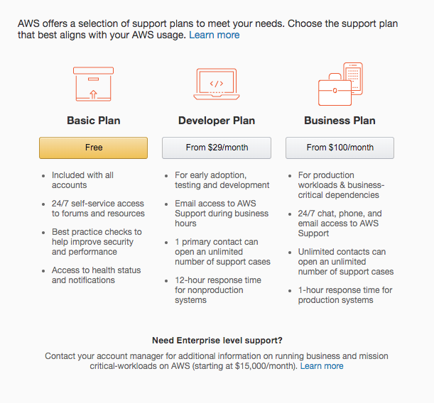
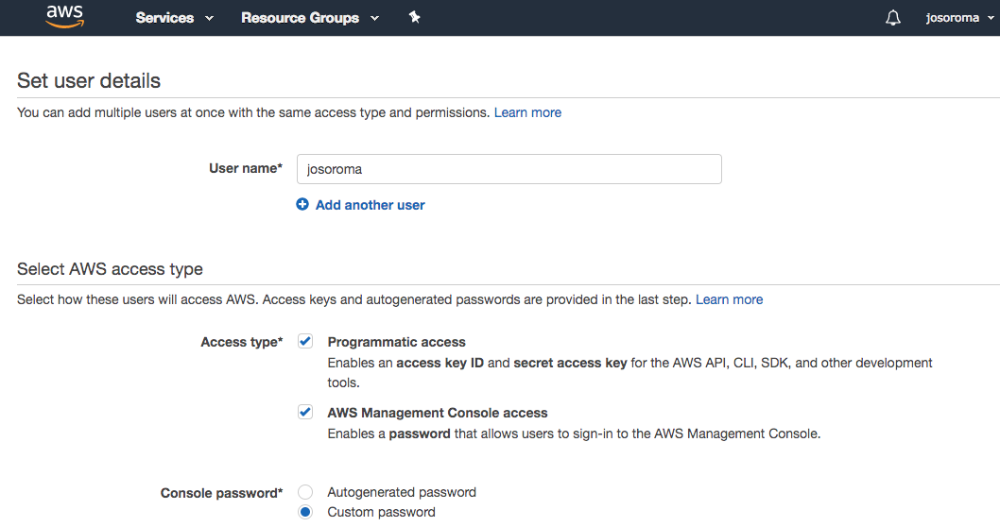
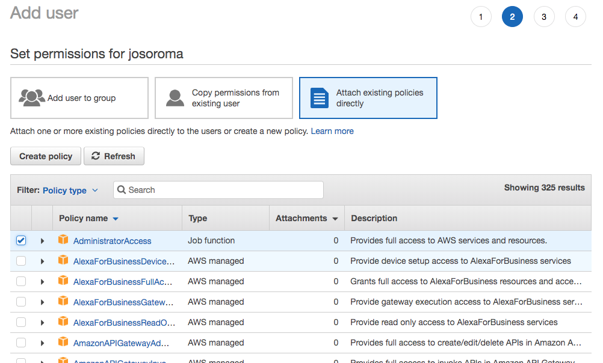
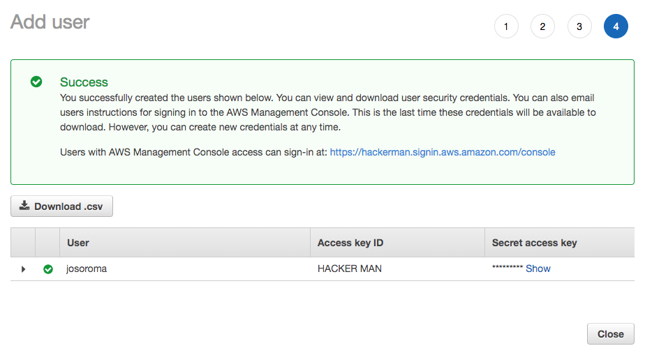
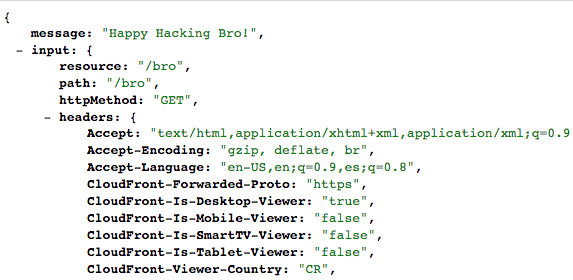

# Serverless Framework

- https://serverless.com

Let's create and deploy a new **service function** on **AWS Lambda** using the **Serverless Framework**.

## Pocket guide

Proudly brought to you by:

- https://gorillalogic.com

## Get an AWS account

- https://console.aws.amazon.com/console/home

```
 mkdir -p ~/Sites/go-serverless-bro

cd ~/Sites/go-serverless-bro
```

```
nvm install 6.10
nvm use 6.10
```

## Install the Serverless Framework

- https://serverless.com/framework/docs/providers/aws/guide/installation

```
npm install -g serverless
```

verify its installation:

```
serverless
```

```
Commands
* You can run commands with "serverless" or the shortcut "sls"
* Pass "--verbose" to this command to get in-depth plugin info
* Pass "--no-color" to disable CLI colors
* Pass "--help" after any <command> for contextual help

Framework
* Documentation: https://serverless.com/framework/docs/

config ........................ Configure Serverless
config credentials ............ Configures a new provider profile for the Serverless Framework
create ........................ Create new Serverless service
deploy ........................ Deploy a Serverless service
deploy function ............... Deploy a single function from the service
deploy list ................... List deployed version of your Serverless Service
deploy list functions ......... List all the deployed functions and their versions
info .......................... Display information about the service
install ....................... Install a Serverless service from GitHub or a plugin from the Serverless registry
invoke ........................ Invoke a deployed function
invoke local .................. Invoke function locally
logs .......................... Output the logs of a deployed function
metrics ....................... Show metrics for a specific function
package ....................... Packages a Serverless service
plugin ........................ Plugin management for Serverless
plugin install ................ Install and add a plugin to your service
plugin uninstall .............. Uninstall and remove a plugin from your service
plugin list ................... Lists all available plugins
plugin search ................. Search for plugins
print ......................... Print your compiled and resolved config file
remove ........................ Remove Serverless service and all resources
rollback ...................... Rollback the Serverless service to a specific deployment
rollback function ............. Rollback the function to the previous version
slstats ....................... Enable or disable stats

Platform (Beta)
* The Serverless Platform is currently in experimental beta. Follow the docs below to get started.
* Documentation: https://serverless.com/platform/docs/

emit .......................... Emits an event to a running Event Gateway
login ......................... Login or sign up for the Serverless Platform
logout ........................ Logout from the Serverless Platform
run ........................... Runs the Event Gateway and the Emulator

Plugins
AwsConfigCredentials, Config, Create, Deploy, Emit, Info, Install, Invoke, Login, Logout, Logs, Metrics, Package, Plugin, PluginInstall, PluginList, PluginSearch, PluginUninstall, Print, Remove, Rollback, Run, SlStats
```

Display its current version:

```
serverless --version
```

```
1.26.1
```

## AWS Console

- https://console.aws.amazon.com

## Create a new user

- https://console.aws.amazon.com/iam/home?#/users$new?step=details

- https://serverless.com/framework/docs/providers/aws/guide/credentials



Provide a `username` and a `password`. During creation please check only their `Administrator Access`.



then set the `Administrator Access` permission:



Please download the `credentials.csv` file and copy the `AWS Management Console URL`.



## Set up the Serverless Framework with your Amazon Web Services account

- https://serverless.com/framework/docs/providers/aws/guide/credentials#using-aws-profiles

For a more permanent solution we are going to set up credentials through AWS profiles.

### Setup with `serverless config credentials` command

- https://serverless.com/framework/docs/providers/aws/cli-reference/config-credentials

Serverless provides a convenient way to configure AWS profiles with the help of the serverless config credentials command.

```
serverless config credentials --provider aws --key HACKERMANKEY --secret HACKERMANSECRET --overwrite

Serverless: Setting up AWS...
Serverless: Saving your AWS profile in "~/.aws/credentials"...
Serverless: Success! Your AWS access keys were stored under the "default" profile.
```

#### Inspect `~/.aws/credentials` file

`code ~/.aws/credentials`

```
[default]
aws_access_key_id = HACKERMANKEY
aws_secret_access_key = HACKERMANSECRET
```

## Let's create our brand new service

- https://serverless.com/framework/docs/providers/aws/cli-reference/create/#creating-a-new-service

```
serverless create -t aws-nodejs --name go-serverless-bro
```

```
Serverless: Generating boilerplate...
 _______                             __
|   _   .-----.----.--.--.-----.----|  .-----.-----.-----.
|   |___|  -__|   _|  |  |  -__|   _|  |  -__|__ --|__ --|
|____   |_____|__|  \___/|_____|__| |__|_____|_____|_____|
|   |   |             The Serverless Application Framework
|       |                           serverless.com, v1.26.1
 -------'

Serverless: Successfully generated boilerplate for template: "aws-nodejs"
```

```
ll
```

```
.gitignore
README.md
handler.js
serverless.yml
```

## code handler.js

```
'use strict';

module.exports.happyHackingBro = (event, context, callback) => {
  const response = {
    statusCode: 200,
    body: JSON.stringify({
      message: 'Happy Hacking Bro!',
      input: event,
    }),
  };

  callback(null, response);
};
```

## code serverless.yml

```
service: happy-hacking-bro

provider:
  name: aws
  runtime: nodejs6.10

functions:
  happyHackingBro:
    handler: handler.happyHackingBro
    events:
      - http:
          path: bro
          method: get
```

## AWS - deploy

- https://serverless.com/framework/docs/providers/aws/cli-reference/deploy

Deploys your entire service via CloudFormation.

Run this command when you have made infrastructure changes (i.e., you edited serverless.yml).

Use serverless `deploy function -f myFunction` when you have made code changes and you want to quickly upload your updated code to AWS Lambda or just change function configuration.

```
serverless deploy
```

```
Serverless: Packaging service...
Serverless: Excluding development dependencies...
Serverless: Creating Stack...
Serverless: Checking Stack create progress...
.....
Serverless: Stack create finished...
Serverless: Uploading CloudFormation file to S3...
Serverless: Uploading artifacts...
Serverless: Uploading service .zip file to S3 (5.19 KB)...
Serverless: Validating template...
Serverless: Updating Stack...
Serverless: Checking Stack update progress...
...............................
Serverless: Stack update finished...
Service Information
service: happy-hacking-bro
stage: dev
region: us-east-1
stack: happy-hacking-bro-dev
api keys:
  None
endpoints:
  GET - https://hackerman.execute-api.us-east-1.amazonaws.com/dev/bro
functions:
  happyHackingBro: happy-hacking-bro-dev-happyHackingBro
```

Test the new endpoint with a Get Request using `httpie`:

```
http https://hackerman.execute-api.us-east-1.amazonaws.com/dev/bro
```

**Response:**

```
HTTP/1.1 200 OK
Connection: keep-alive
Content-Length: 1458
Content-Type: application/json
Date: Wed, 21 Mar 2018 21:50:32 GMT
Via: 1.1 cf48a08b49dfcb45abb5308eb3e6e941.cloudfront.net (CloudFront)
X-Amz-Cf-Id: RDukXeUDmyKyQhiWa8CjrMN3IZTtoLfxP4lg6x7j9bFLatjIYcy7_Q==
X-Amzn-Trace-Id: sampled=0;root=1-5ab2d3a8-e20322f9d4032a634f329f12
X-Cache: Miss from cloudfront
x-amzn-RequestId: e11bdacc-2d51-11e8-b9ba-93aa1475ffcf

{
    "input": {
        "body": null,
        "headers": {
            "Accept": "*/*",
            "Accept-Encoding": "gzip, deflate",
            "CloudFront-Forwarded-Proto": "https",
            "CloudFront-Is-Desktop-Viewer": "true",
            "CloudFront-Is-Mobile-Viewer": "false",
            "CloudFront-Is-SmartTV-Viewer": "false",
            "CloudFront-Is-Tablet-Viewer": "false",
            "CloudFront-Viewer-Country": "CR",
            "Host": "hackerman.execute-api.us-east-1.amazonaws.com",
            "User-Agent": "HTTPie/0.9.9",
            "Via": "1.1 hackermancode.cloudfront.net (CloudFront)",
            "X-Amz-Cf-Id": "hackermancode",
            "X-Amzn-Trace-Id": "Root=hackermancode",
            "X-Forwarded-For": "hackermanip, anotherhackermanip",
            "X-Forwarded-Port": "443",
            "X-Forwarded-Proto": "https"
        },
        "httpMethod": "GET",
        "isBase64Encoded": false,
        "path": "/bro",
        "pathParameters": null,
        "queryStringParameters": null,
        "requestContext": {
            "accountId": "...",
            "apiId": "hackermanid",
            "httpMethod": "GET",
            "identity": {
                "accessKey": null,
                "accountId": null,
                "caller": null,
                "cognitoAuthenticationProvider": null,
                "cognitoAuthenticationType": null,
                "cognitoIdentityId": null,
                "cognitoIdentityPoolId": null,
                "sourceIp": "hackermanip",
                "user": null,
                "userAgent": "HTTPie/0.9.9",
                "userArn": null
            },
            "path": "/dev/bro",
            "protocol": "HTTP/1.1",
            "requestId": "",
            "requestTime": "21/Mar/2018:21:50:32 +0000",
            "requestTimeEpoch": 1521669032710,
            "resourceId": "hackermanresourceid",
            "resourcePath": "/bro",
            "stage": "dev"
        },
        "resource": "/bro",
        "stageVariables": null
    },
    "message": "Happy Hacking Bro!"
}
```

## Via Browser

`chrome https://hackerman.execute-api.us-east-1.amazonaws.com/dev/bro`



## AWS - Invoke Local

- https://serverless.com/framework/docs/providers/aws/cli-reference/invoke-local

```
serverless invoke local --function happyHackingBro
```

```
{
    "statusCode": 200,
    "body": "{\"message\":\"Happy Hacking Bro!\",\"input\":\"\"}"
}
```

## Remove current Serverless service and all resources

- https://serverless.com/framework/docs/providers/aws/cli-reference/remove

```
serverless remove
```

```
Serverless: Getting all objects in S3 bucket...
Serverless: Removing objects in S3 bucket...
Serverless: Removing Stack...
Serverless: Checking Stack removal progress...
....................
Serverless: Stack removal finished...
```